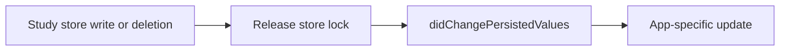
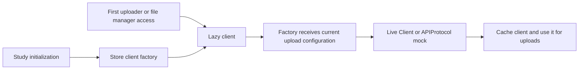
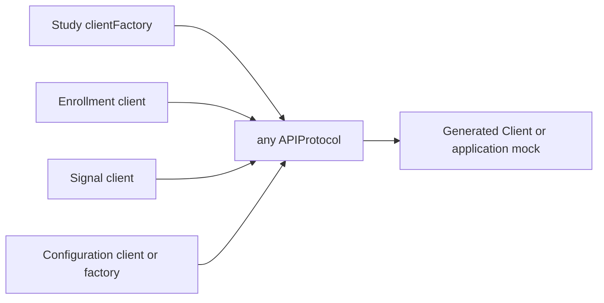

# OpenResearchKit-Swift

A Swift Package to conduct scientific research in iPhone apps:
- Invite users to participate
- Get user consent
- Surveys
- Collect study data
- Combine survey replies and study data anonymously

## Multiple mid-study surveys

Configure multiple mid-study surveys with `midStudySurveys`:

```swift
let study = LongTermWithMidSurveyStudy(
    // ...
    midStudySurveys: [
        .init(
            showAfter: 7 * 24 * 60 * 60,
            url: URL(string: "https://example.com/week-one-survey")!,
            expiresAfter: 3 * 24 * 60 * 60
        ),
        .init(
            showAfter: 14 * 24 * 60 * 60,
            url: URL(string: "https://example.com/week-two-survey")!
        )
    ],
    // ...
)
```

`showAfter` is measured from participant consent. The optional `expiresAfter` value is the survey-window duration measured from survey availability. An expiring survey is skipped if it is not completed during that window. Omit `expiresAfter` to keep a survey available indefinitely. Surveys are presented chronologically as they become due. Both intervals must be finite, and `expiresAfter` must be greater than zero.

Each value returned by `study.midStudySurveys` exposes its persisted completion state through `hasBeenCompleted`. Because `MidStudySurvey` is a value type, re-read the array after the study publishes a state change. Expired surveys that were never submitted remain incomplete.

The singular `midStudySurvey` initializer remains supported for studies with one mid-study survey.

When updating an existing study from the singular initializer, keep the original survey as the first entry in `midStudySurveys`; that position is used once to migrate existing completion state. Presentation order is still determined by `showAfter`. If a survey's URL or schedule might change in a later release, give it a stable identity:

```swift
.init(
    id: "week-one",
    showAfter: 7 * 24 * 60 * 60,
    url: URL(string: "https://example.com/week-one-survey")!
)
```

Use a unique `id` for each logical survey in a study. Identical entries with the same `id` are treated as the same survey; reusing an ID with a different URL or schedule is a configuration error.

After resolving a URL scheme or deep link to a `Study`, present its introductory survey directly with `study.showIntroSurvey()`.

## Persisted study value changes

Override `Study.didChangePersistedValues()` when an app needs to update other state after a study value changes. OpenResearchKit calls it after a successful store write or deletion and after releasing the store lock. The override can read current study properties.



## Study Data Uploads

OpenResearchKit uploads study data through a v2 study API. Each `Study` creates its client, uploader, and file manager on first access. The default client uses the study's current `UploadConfiguration`, including its server URL and API key.

Pass `clientFactory` to a study initializer to use a mock that conforms to the generated `APIProtocol`, or a generated `Client` with a custom transport:

```swift
let study = Study(
    studyIdentifier: "example-study",
    studyInformation: information,
    uploadConfiguration: uploadConfiguration,
    introductorySurveyURL: nil,
    clientFactory: { configuration in
        Client(
            baseURL: configuration.serverURL,
            apiKey: configuration.apiKey,
            transport: mockTransport
        )
    }
)
```

`APIProtocol`, `Operations`, and `Components` are public generated types. Application code can use them with a normal `import OpenResearchKit`; no `@testable` import is needed. A direct `APIProtocol` implementation must implement all five operations.

For a partial mock, conform to the public `MockAPIClient` protocol and implement only the operations you need:

```swift
import OpenResearchKit

actor MockClient: MockAPIClient {
    private(set) var uploadCount = 0

    func uploadStudyFile(
        _ input: Operations.UploadStudyFile.Input
    ) async throws -> Operations.UploadStudyFile.Output {
        uploadCount += 1
        return .ok(.init(body: .json(.init(result: .init(success: true)))))
    }
}
```

Pass it through `clientFactory: { _ in MockClient() }`. Operations that the mock does not implement throw `MockAPIClientError.unimplementedOperation(operationID:)` without making a network request. This makes unexpected calls visible to the test.

Both protocols require `Sendable`. Use an actor when the mock records mutable state. The generated `Client` is a struct and cannot be subclassed; protocol mocks support structs, classes, and actors.

The factory is stored during initialization. First client access calls it with the configuration at that time and caches the result. Later configuration changes do not replace the cached client. As with any Swift `lazy` property, first access must be serialized to guarantee one initialization. All `LongTermStudy` and `LongTermWithMidSurveyStudy` initializers accept the factory; `DataDonationStudy` inherits it.



The study factory controls file uploads, including automatic `uploadIfNecessary()` calls. Enrollment, signals, and remote study configuration each accept an `APIProtocol` implementation separately:

```swift
let mock = MockClient()
let enrollmentService = RemoteEnrollmentService(client: mock)
let signalService = DefaultSignalService(client: mock)
let configurationService = RemoteStudyConfigurationService(client: mock)
let registry = StudyRegistry(
    studies: [study],
    studyConfigurationService: configurationService
)
```

Implement the enrollment, signal, and configuration operations in the mock when the test calls those services. Each service uses the provided client for all its calls. Existing code that passes a generated `Client` still works.

`RemoteStudyConfigurationService()` keeps its default behavior: it creates a client for each check from that study's current upload configuration. To provide a client factory instead, use `RemoteStudyConfigurationService(clientFactory: { configuration in ... })`. The factory is called during each check; it is not called during service initialization and its result is not cached.



`UploadConfiguration` sets the default client's connection details and the upload frequency:

```swift
UploadConfiguration(
    serverURL: URL(string: "https://research.example.com")!,
    uploadFrequency: 60 * 60 * 24,
    apiKey: "..."
)
```

The generated OpenAPI client sends the API key as the `X-API-Key` header. Local files that are ready for upload are staged in timestamped batches under `OpenResearchKit/Studies/<study>/upload/yyyyMMdd_HHmmss/`. A successful upload removes each uploaded local file and then marks the study upload as successful after the whole batch sweep completes.

### Optional live upload integration tests

Upload integration tests run offline by default. To test uploads against the live study API, provide the private API key and server-side study identifier through the environment:

```sh
OPENRESEARCHKIT_RUN_LIVE_UPLOAD_TESTS=1 \
OPENRESEARCHKIT_STUDY_API_KEY='<private-key>' \
OPENRESEARCHKIT_LIVE_UPLOAD_STUDY_IDENTIFIER='<server-study-id>' \
xcodebuild test -scheme OpenResearchKit -destination 'platform=iOS Simulator,name=iPhone 17 Pro,OS=26.4' -only-testing:OpenResearchKitTests/StudyDataUploaderLiveIntegrationTests
```

`OPENRESEARCHKIT_STUDY_API_BASE_URL` can be set to override the default `https://study.one-sec.app` endpoint. When the run flag or required credentials are missing, the live integration test is skipped.


